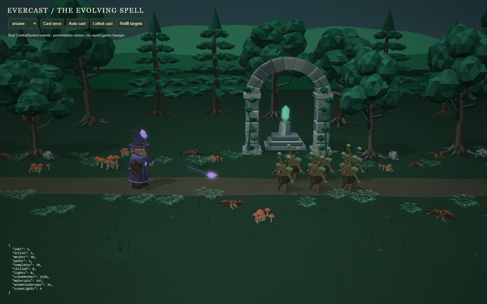
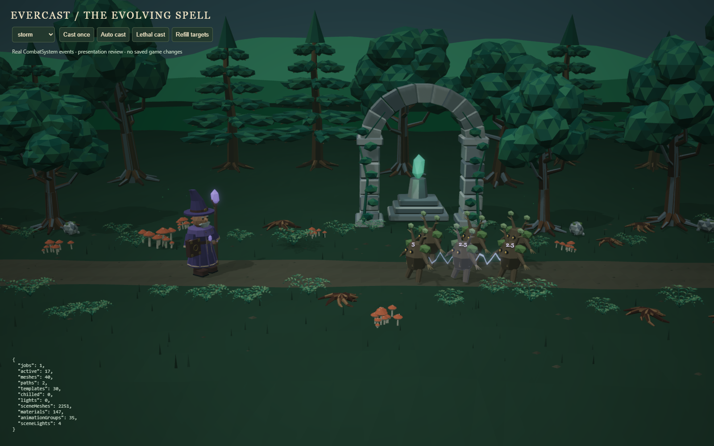
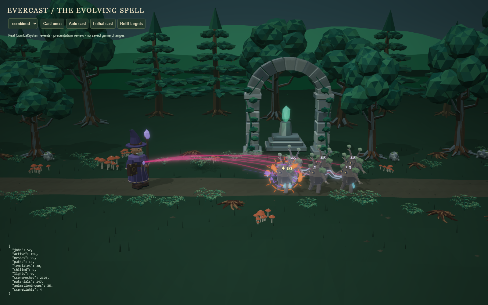
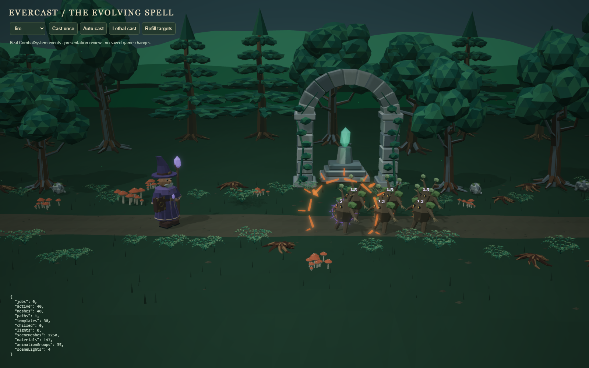
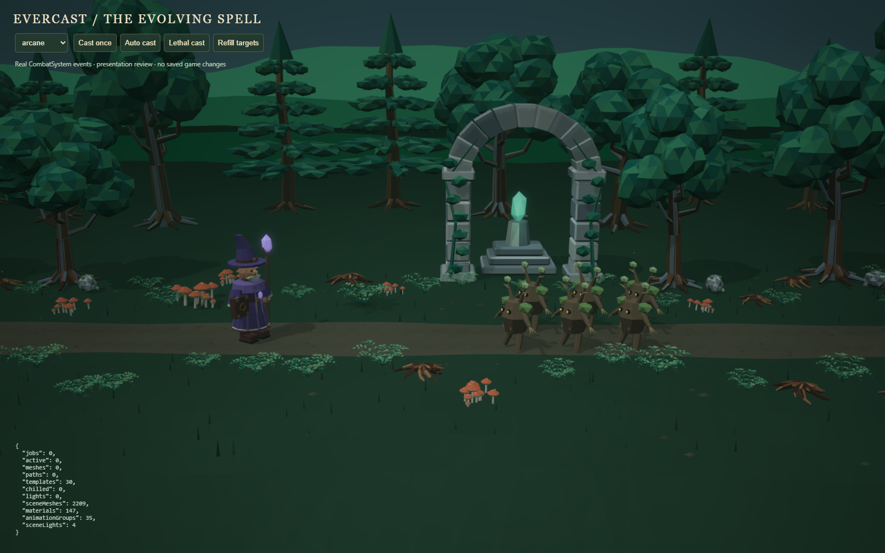
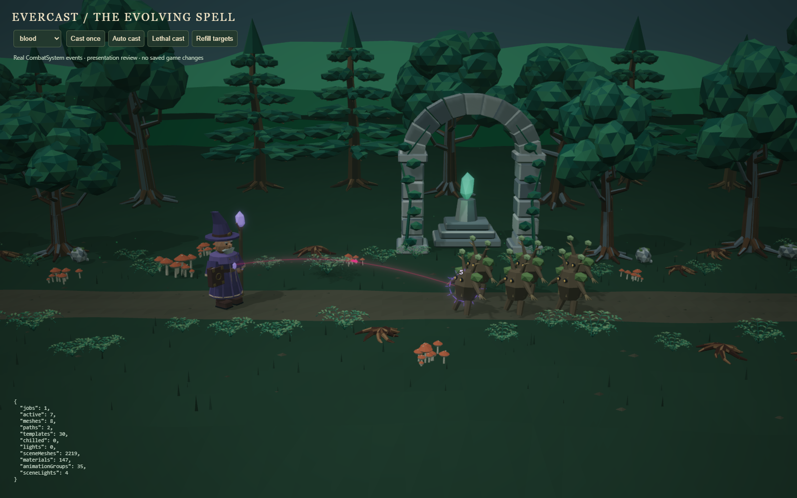
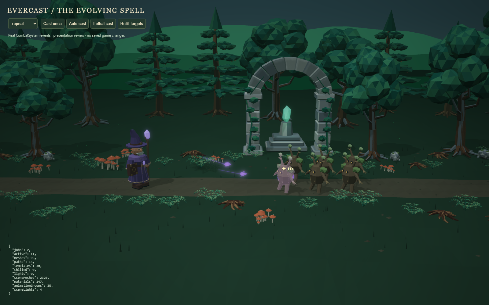
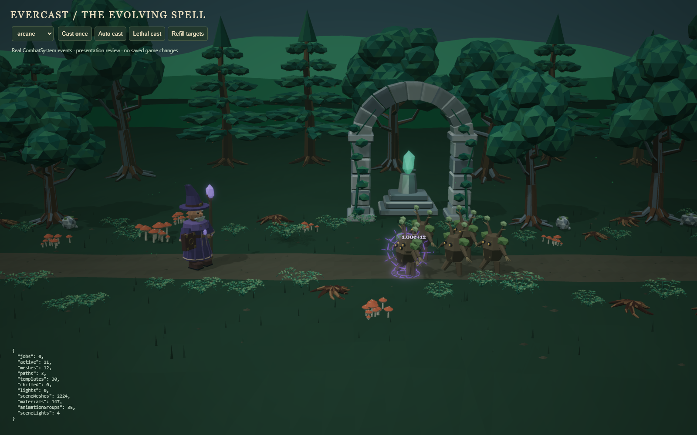

# Combat VFX

The one evolving spell is composed at runtime from small faceted meshes, short
procedural paths, and the simulation's hit events. Damage, target selection,
control, healing, deaths, and rewards remain entirely in `src/engine`.

## Assets

`public/models/vfx/manifest.json` lists 30 GLBs: 10 Arcane, 6 Fire, 6 Frost,
4 Storm, and 4 Blood pieces. Together they contain 3,996 triangles and occupy
about 346 KiB including the manifest. The editable source is
`art/vfx/evercast_vfx.blend`; regenerate it with Blender 5.2:

```powershell
& 'C:\Program Files\Blender Foundation\Blender 5.2\blender.exe' --background --factory-startup --python tools/blender/build_vfx.py
```

Each exported piece has a centered pivot, metre units, one emissive-ready material,
flat facets, and no animation, skeleton, camera, or light. Rings and glyphs lie in
Blender XY (Babylon XZ); the presenter rotates them to face the combat camera where
appropriate. Shards and cores have a longitudinal Blender Z axis (Babylon Y).
The `.blend` arranges the pieces on a review grid **after** exporting them at origin.
There are no baked spell trajectories or world coordinates in the GLBs.

## Presentation ownership

- `CombatVfxPlan` translates one atomic cast's emitted hits into cosmetic routes and
  timestamps. Direct plus sequence-sorted pierce hits share **one moving core**.
  Chain links use each event's `sourceInstanceId`; splash creates no new projectile.
  Repeats have their own quieter, slightly delayed flight.
- `SpellVfxPresenter` captures target anchors, schedules short visual actions,
  samples the **current** staff socket at release, and composes school treatments.
  Active spell-tree regions only choose decoration; they never choose hit targets.
- `CombatFxPresenter` owns impact glyphs/shards, critical emphasis, temporary chill,
  authored hit/death animation triggers, bounded camera impulses and optional light.
- `DamageNumbers` reuses at most 24 DOM labels, formatted from emitted damage.
  Labels appear at visual impact and retain critical emphasis over tiny secondary hits.
- `VfxPool` loads templates once, bakes the glTF coordinate conversion once, shares
  six materials and template geometry, and reuses mesh and dynamic ribbon slots.
  Lightning modifies fixed vertex buffers rather than rebuilding tubes each frame.

The attack clip is compressed to 60–240 ms according to cast cadence. Charge follows
the moving socket until its midpoint release. Direct flight lasts 140 ms; subsequent
pierce segments take 45 ms and chain hops 35 ms. Cosmetic jobs are capped at 650 ms.
These timings never postpone authoritative damage or feed collision results back
into the engine. Large frame steps can compress several visual moments into one frame.

Death actors remain briefly available for the last impact and their authored death
clip, with a 24-actor retirement ceiling. A bounded, one-second anchor cache handles
enemies that spawn and die in one simulation advance. Missing anchors never redirect
effects to another living enemy. All jobs hold captured positions, not ownership of
actors; disposed actors and late downloads cannot resurrect effects.

## Minimal event additions

`projectile_hit.healing` is the actual health restored after the existing max-HP
clamp. `controlDelaySeconds` is the attack delay actually applied to a surviving
target. Both are optional for compatibility with older callers. Neither changes
combat calculations, damage timing, balance, or saves. Blood flows enemy → mage only
when actual restoration is positive. Frost accents accumulate to three visual levels
and expire within 2.5 seconds after the final hit; this is a cosmetic lifetime, not a
replacement for the authoritative attack cooldown.

Actor geometry and materials remain shared. Actor mesh clones permit independent
short overlays, so one hit never flashes all instances of an enemy type. No enemy
material is permanently recolored for chill. The staff socket is cached after load.

## Quality and degradation

Pass `low`, `medium` (default), or `high` as the second `EvercastScene` constructor
argument. Gameplay is identical at every quality. `VFX_BUDGETS` is the central policy:

| Quality | Piece slots | Path slots | Pending jobs | Shards / burst | Lightning segments | Spell lights |
| --- | ---: | ---: | ---: | ---: | ---: | ---: |
| Low | 48 | 16 | 192 | 2 | 8 | 0 |
| Medium | 96 | 32 | 384 | 4 | 12 | 0 |
| High | 160 | 48 | 576 | 7 | 16 | 1 |

Repeated bursts within 70 ms coalesce. Repeated lightning edges and siphons share
active slots. Decoration is discarded before core effects. At a fully saturated
pool, new core samples replace the oldest samples; the system does not attempt to
display an unbounded number of simultaneous identical projectiles. Pending work
coalesces duplicate semantic edges, preserving their earlier due time to prevent
starvation. Extremely high rates therefore simplify the display rather than queueing
seconds of obsolete combat. Quality is explicit rather than a hidden gameplay change.

All pieces have a maximum three-second lifetime, paths normally last 60–280 ms,
camera displacement is at most 0.025 world units, and there are no particle systems,
per-hit textures, timers, or per-effect scene observers. High's one light is restricted
to the hit actor; it does not brighten trees or consume additional environment lights.
Retained inactive slots are intentional pool capacity; active effects and jobs drain
to zero, and scene disposal releases the pool, templates, labels, and light.

## Verification and review

`npm run validate` runs contract, real-GLB, lifecycle, engine regression tests, and
the production build. Lifecycle tests exercise 800 real five-projectile casts at
10 ms intervals with six targets, pierce, three chain hops, five splash targets,
guaranteed criticals, two repeats, control and leech at every quality. They check a
stable resource plateau, target removal, complete drain, and late-load disposal.

For browser review, run `npm run dev`, then open
`/tools/review/vfx.html`. This source-only fixture uses the real `CombatSystem` and
snapshot builder and never loads or edits a saved game. Choose individual effects,
combined or stress mode; cast once, auto-cast, perform a lethal cast, or refill targets.
`?quality=low|medium|high` selects a budget. `window.__vfxReview.frame(mode, seconds,
lethal)` provides repeatable paused captures; `stats()` exposes pool and scene counts.
The fixture is typechecked but is not a production entry point.

Browser verification included an accelerated 600-cast run, real-time combined combat,
rapid target removal, asset loading, and production gameplay. The final medium
budget has 128 total active slot capacity. Earlier/later resource counts plateaued;
after cleanup only the mage's five animation groups remained, with zero active VFX,
queued jobs, or chilled targets. Browser errors were checked separately.
The final [resource samples](media/vfx/stress.json) are checked in with the captures.

Performance is still platform-dependent: at 1600×1000 on this local browser the
final six-enemy Woods scene measured roughly 35 ms median idle versus 49 ms under
the extreme combined stress case ([raw frame samples](media/vfx/frame-times.json)).
This is **not** a 60-FPS endgame guarantee. Low is available for tighter budgets;
future optimization can batch transparent pieces without changing the event contract.

Screenshots below capture the actual runtime. Video recording was blocked by the
automatic approval policy; the fixture provides reproducible animated review.

| Charge | Flight |
| --- | --- |
|  |  |

| Sequential chain | Combined modifiers |
| --- | --- |
|  |  |

| Fire splash | Temporary frost |
| --- | --- |
|  |  |

| Blood siphon | Critical and echoes |
| --- | --- |
|  |  |


