# Evercast UI/UX audit

A full pass over every interface the game draws, at desktop, tablet, phone
portrait and phone landscape, measured against what a AAA-quality release would
be expected to do. It is organised so it can be triaged rather than read: every
finding has an id, a severity, the screens it affects, and what is actually
wrong as opposed to what could be nicer.

The short version is that **the system is excellent and the screens are not**.
The token sheet, the five-archetype rule, the safe-area handling and the
static test suite are better than most shipped games have. What is missing is
everything those rules cannot see: whether a screen is *worth looking at*,
whether the thing you came to do is on it, and whether the game tells you
anything about what just happened. Nearly every finding below is of that kind.

---

## Contents

1. [How this was measured](#1-how-this-was-measured)
2. [Executive summary](#2-executive-summary)
3. [Severity index](#3-severity-index)
4. [Blocking defects](#4-blocking-defects)
5. [Layout and responsive behaviour](#5-layout-and-responsive-behaviour)
6. [Navigation and information architecture](#6-navigation-and-information-architecture)
7. [The HUD and game feel](#7-the-hud-and-game-feel)
8. [Surface-by-surface](#8-surface-by-surface)
9. [Typography, colour and iconography](#9-typography-colour-and-iconography)
10. [Accessibility](#10-accessibility)
11. [Copy and text](#11-copy-and-text)
12. [What a AAA bar would add](#12-what-a-aaa-bar-would-add)
13. [Recommended sequence](#13-recommended-sequence)
14. [Regression tests worth adding](#14-regression-tests-worth-adding)

---

## 1. How this was measured

The running game was driven with Playwright against `npm run dev`, with three
seeded saves generated by the engine itself (`EvercastSimulation` advanced
headlessly, then encoded through `SaveCodec` and written to
`localStorage['evercast.save.v1']`):

| Save | State |
| --- | --- |
| `fresh` | 30 seconds old. Frontier 5, no companions, one granted spell point. |
| `mid` | ~8h. Frontier 230, 16 companions, gear ~Lv 400. (Generated for comparison; the screenshot sweeps used `fresh` and `late`.) |
| `late` | ~40h + 3 rebirths. Frontier 765, 25 companions, 105/105 nodes, 3 attunements, gold 7.6e47. |

Every surface was opened at thirteen viewports — 1920x1080, 1440x900,
1280x800, 1024x768, 820x1180, 1180x820, 390x844, 360x800, 320x568, 844x390,
932x430, 667x375, 568x320 — with `hasTouch` set on the tablet and phone
contexts so `@media (pointer: coarse)` applied. At each stop the harness
screenshotted the screen and measured, in the live DOM: elements crossing the
viewport edge, interactive elements under 44x44, interactive elements below the
fold, scroll containers with hidden content, and whether the surface's own Back
button was clickable.

### Limits of the measurement, stated plainly

- **Fonts.** The container has no Georgia and no Inter, so `--font-display`
  and `--font-ui` both fell back (DejaVu Serif / DejaVu Sans). Text metrics in
  the screenshots are therefore *approximate* — some wrapping shown here will
  differ by a few pixels on a real device. This is itself finding
  [TYP-1](#typ-1-the-game-ships-no-fonts).
- **Rendering.** WebGL ran on SwiftShader (software). Frame rates measured
  here say nothing about real hardware and **no performance claim in this
  document is based on them**. What software rendering *does* legitimately
  show is main-thread blocking, which is CPU-bound either way.
- Findings marked *(code)* were established by reading the source rather than
  by observing them, and say so.

Seventeen of the captures are checked in under `docs/media/ui-audit/` and are
linked from the findings they evidence. They were taken with the fallback
fonts described above, so read them for layout, not for letterforms.

---

## 2. Executive summary

The ten things that matter most, in order.

1. **Rebirth is a navigation trap.** Opening it covers the header, the Back
   button and the whole nav rail with its own 72%-opaque scrim, which also
   swallows clicks. On a phone there is no Escape key, so the only way out is
   a shelf slot. [BLK-1](#blk-1-the-rebirth-surface-traps-the-player)
2. **The spell tree — the game's headline system — is unusable on a phone and
   barely usable on a desktop.** The fit is clamped at 25%, so on a phone the
   graph is cut off on all four sides and *cannot be fitted*; `Fit` is a no-op.
   No node at any viewport reaches 44px, and the 63 `minor` nodes measure
   6-12px. The minimap is disabled on exactly the screens that need it.
   [BLK-2](#blk-2-the-spell-tree-cannot-be-fitted-or-aimed-at)
3. **The primary action of the Gear screen is below the fold on a phone**,
   with no scroll affordance. Buying gear levels is the core loop.
   [BLK-3](#blk-3-the-gear-buy-control-is-below-the-fold-on-a-phone)
4. **Nothing tells you that you died.** The mage falling — the only real
   failure state — produces one log line that the next event overwrites a
   second later, and a quiet change of a pill from `PUSHING` to `FARMING n`.
   The `Moment` archetype exists for exactly this and nothing uses it.
   [FEEL-1](#feel-1-death-is-invisible)
5. **The HUD hides the fight.** The enemy card, the health bar and the wave
   counter only render `phase === 'combat' && boss`. In every non-boss
   encounter there is no enemy name, no enemy health and no wave progress
   anywhere in the HUD. [HUD-1](#hud-1-the-encounter-is-invisible-unless-it-is-a-boss)
6. **The game is mostly empty space on a desktop.** Character, Gear,
   Attunements, Rebirth and Summon all stop between a third and a half of the
   way down a 1440x900 screen and leave the rest black; at 1920x1080 item
   names ellipsise while 500px sit unused beside them.
   [LAY-1](#lay-1-surfaces-do-not-use-the-screen)
7. **Currency is encoded in colour alone below 560px.** The header wallets
   drop their labels for a coloured dot, so three different currencies become
   three numbers a colour-blind player cannot tell apart. WCAG 1.4.1.
   [A11Y-1](#a11y-1-wallets-are-colour-only-below-560px)
8. **The nav rail never scrolls the current destination into view.** Open
   Settings from More on a phone and the strip shows no selected entry at all.
   [NAV-2](#nav-2-the-rail-never-shows-where-you-are)
9. **Player-facing text leaks engine identifiers.** `dot deals 9.97e47.`,
   `supercharge: 3.`, `ringLeft reached gear level 5.` all reach the log
   verbatim. [TXT-1](#txt-1-raw-identifiers-in-the-event-log)
10. **The world and the HUD disagree about where you are.** The renderer
    picks its biome from travel distance; the HUD names the zone from the
    snapshot. At Frontier 765 the HUD said *Gravehollow* over a green-grass,
    blue-sky Greenfields scene. [FEEL-4](#feel-4-the-hud-and-the-world-name-different-places)

### What is already very good

Worth saying, because the fixes below should not disturb it: the closed token
set, the five-archetype discipline, `--shelf-inset` and the safe-area
handling, `inert` on the boot gate, `useDialog`'s real focus management, the
derived (rather than scripted) onboarding, the `dvh` sizing, the boot gate
doubling as the audio gesture, and the deliberate landscape-phone breakpoint
are all better than the norm. The problems are on top of a good foundation.

---

## 3. Severity index

**S1 — blocking**: the player cannot complete an intended action.
**S2 — major**: the action is possible but the screen misleads, hides or
frustrates.
**S3 — polish**: quality gap against a AAA bar.

| Id | Severity | Area | Finding |
| --- | --- | --- | --- |
| [BLK-1](#blk-1-the-rebirth-surface-traps-the-player) | S1 | Rebirth | Moment scrim covers and blocks the header and rail |
| [BLK-2](#blk-2-the-spell-tree-cannot-be-fitted-or-aimed-at) | S1 | Spell tree | Fit clamped at 25%; graph unfittable on a phone; 6-9px targets |
| [BLK-3](#blk-3-the-gear-buy-control-is-below-the-fold-on-a-phone) | S1 | Gear | Buy control below the fold, no affordance |
| [BLK-4](#blk-4-the-first-frame-after-continue-blocks-for-seconds) | S2 | Boot | Away settle blocks the main thread in one burst |
| [LAY-1](#lay-1-surfaces-do-not-use-the-screen) | S2 | All | 30-60% dead space on desktop; truncation at 1920 |
| [LAY-2](#lay-2-the-shelf-vitals-wrap-between-621px-and-860px) | S2 | Shelf | Vitality readout wraps into the meter |
| [LAY-3](#lay-3-two-stacked-scroll-regions-with-no-affordance) | S2 | Detail/Graph | Two scrollers, no fade, content cut mid-row |
| [LAY-4](#lay-4-the-list-band-is-45-of-the-height-whatever-is-in-it) | S2 | Detail | 45% band for a 3-item or empty list |
| [LAY-5](#lay-5-the-diorama-is-framed-for-one-aspect-ratio) | S3 | Scene | Portrait and ultrawide framing unhandled |
| [NAV-1](#nav-1-more-is-a-dead-end-not-a-menu) | S2 | Nav | More jumps into a surface instead of opening a menu |
| [NAV-2](#nav-2-the-rail-never-shows-where-you-are) | S2 | Nav | Active entry not scrolled into view; no strip affordance |
| [NAV-3](#nav-3-no-keyboard-route-into-anything) | S2 | Nav | Escape is the only key the game binds |
| [NAV-4](#nav-4-pinned-destinations-are-not-actually-pinnable) | S3 | Nav | `DEFAULT_PINNED` is a constant; no reorder |
| [NAV-5](#nav-5-no-back-stack) | S3 | Nav | No history, no deep link, browser Back leaves the game |
| [HUD-1](#hud-1-the-encounter-is-invisible-unless-it-is-a-boss) | S2 | HUD | Enemy card gated on `boss` |
| [HUD-2](#hud-2-the-log-is-a-single-line-and-disappears-below-860px) | S2 | HUD | One line, no history, hidden on tablet and phone |
| [HUD-3](#hud-3-no-rate-anywhere) | S2 | HUD | No gold/s, essence/s, or time-to-afford |
| [HUD-4](#hud-4-damage-numbers-pile-up) | S3 | VFX | Overlapping, unreadable at high fire rates |
| [FEEL-1](#feel-1-death-is-invisible) | S2 | Feel | No defeat moment |
| [FEEL-2](#feel-2-rebirth-is-irreversible-and-unconfirmed) | S2 | Feel | One click, no confirm, no itemised preview |
| [FEEL-3](#feel-3-respec-is-the-same) | S2 | Feel | 105 points undone with no confirmation |
| [FEEL-4](#feel-4-the-hud-and-the-world-name-different-places) | S2 | Feel | Zone name/accent decoupled from rendered biome |
| [FEEL-5](#feel-5-no-reward-beat-for-anything-but-a-summon) | S3 | Feel | Evolution, rebirth, new zone, milestone all silent |
| [SUR-*](#8-surface-by-surface) | S2/S3 | Surfaces | See section 8 |
| [TYP-1](#typ-1-the-game-ships-no-fonts) | S2 | Type | Georgia/Inter with no webfont |
| [TYP-2](#typ-2-numbers-are-not-actually-aligned) | S2 | Type | Suffix inside the cell breaks the column |
| [TYP-3](#typ-3-hyphens-doing-the-work-of-dashes) | S3 | Type | `-`, `·` and `—` used interchangeably |
| [TYP-4](#typ-4-no-number-format-choice) | S3 | Type | `e`-notation only; fractional Starlight |
| [A11Y-1](#a11y-1-wallets-are-colour-only-below-560px) | S2 | A11y | WCAG 1.4.1 |
| [A11Y-2](#a11y-2-touch-targets-under-44px) | S2 | A11y | Toggle 52x30; spell nodes 6-9px |
| [A11Y-3](#a11y-3-text-over-the-diorama-is-unmeasured) | S2 | A11y | Contrast asserted against tokens, not the scene |
| [A11Y-4](#a11y-4-no-in-game-accessibility-settings) | S3 | A11y | No text size, no colour-blind mode, no motion toggle |
| [TXT-1](#txt-1-raw-identifiers-in-the-event-log) | S2 | Copy | `dot deals`, `supercharge:`, `ringLeft` |
| [TXT-2](#txt-2-the-welcome-back-clock-is-wrong) | S2 | Copy | `1 minutes`, `0 minutes`, `1h 60m` |
| [TXT-3](#txt-3-two-rings-with-the-same-name) | S3 | Copy | Both rings read `Evercast Signet` |
| [TXT-4](#txt-4-numbers-said-twice) | S3 | Copy | Pity, ascension and rebirth each state themselves 2-3x |

---

## 4. Blocking defects

### BLK-1: the Rebirth surface traps the player

**Severity S1. Every viewport. Reproduced at 1280x800, 1024x768, 1180x820,
820x1180 and 390x844.**

`RebirthSurface` renders a `Moment` with `modal={false}`, which is the right
call — it is a destination in the rail, not an overlay over one. But
`Moment.module.css` gives `.scrim` `position: absolute; inset: 0;
background: var(--scrim); pointer-events: auto` **unconditionally**, and
`.surface` / `.body` in `SurfaceHost.module.css` are not positioned. The
nearest positioned ancestor is therefore `.host` itself, so the scrim resolves
against the whole surface host.

Measured at 1440x900 with the `late` save:

```
host rect     0,0 1440x768
scrim rect    0,0 1440x768        background rgba(7,13,16,0.72)   pointer-events auto
Back button   24,19 74x38   -> elementFromPoint returns DIV._scrim
rail "Gear"    8,194 227x44  -> elementFromPoint returns DIV._scrim
click Back    -> Playwright: timeout, element intercepts pointer events
```

Two consequences:

1. **The header, the Back button and the entire nav rail are covered by a
   72%-opaque wash** — which is exactly the "washed out" look in the Rebirth
   screenshot, and it is not a design choice, it is a positioning bug.
2. **They cannot be clicked.** `useEscape` in `SurfaceHost` still fires, so a
   desktop keyboard user can leave. A touch user cannot: there is no Escape
   key, and the only escape is a shelf slot, because the shelf happens to sit
   outside `.host` (`inset: 0 0 var(--shelf-inset) 0`).


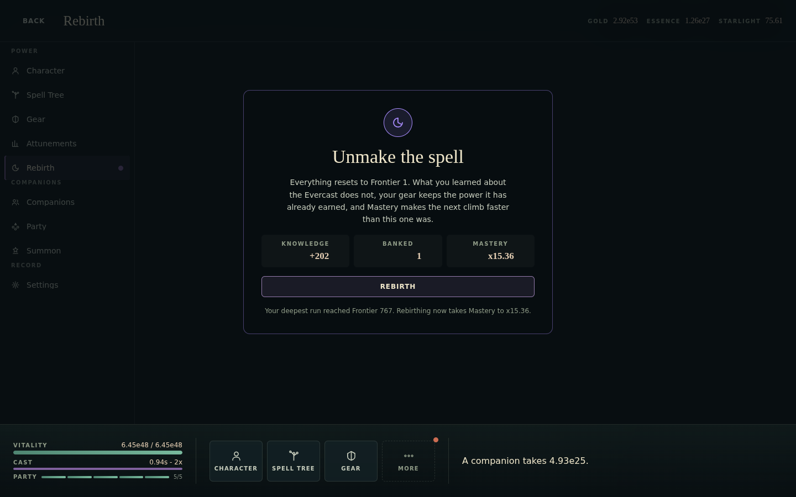

**Fix.** Either give `.scrim` `position: static` / no background when
`modal === false`, or give `.surface` `position: relative` so a non-modal
moment is contained by the pane it belongs to. The second is the smaller
change and fixes the wash as well. Add an assertion that no `[role="group"]`
moment paints a scrim.

---

### BLK-2: the spell tree cannot be fitted, or aimed at

**Severity S1. Worst on phones; present everywhere.**

Three separate problems compound on the game's headline system.

**(a) The fit is clamped, so on a phone the graph cannot be fitted at all.**
`DEFAULT_SCALE_LIMITS.min` is `0.25` and `fitToBounds` clamps to it. The
layout's bounds are 1719x1846. On a 390x844 phone the graph viewport measures
roughly 390x318, so the scale the graph actually needs is

```
min((390-48)/1719, (318-48)/1846) = min(0.199, 0.146) = 0.146
```

clamped up to `0.25`, which draws the tree at 430x461 inside a 390x318 box.
It overflows on all four sides, and **pressing `Fit` recomputes the same
clamped transform, so the button does nothing**. There is no indication that
anything is off-screen.


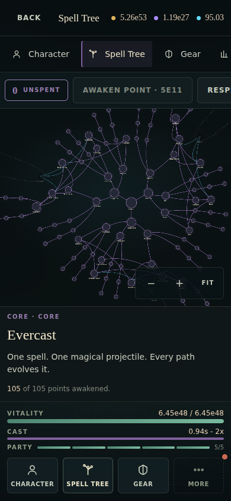

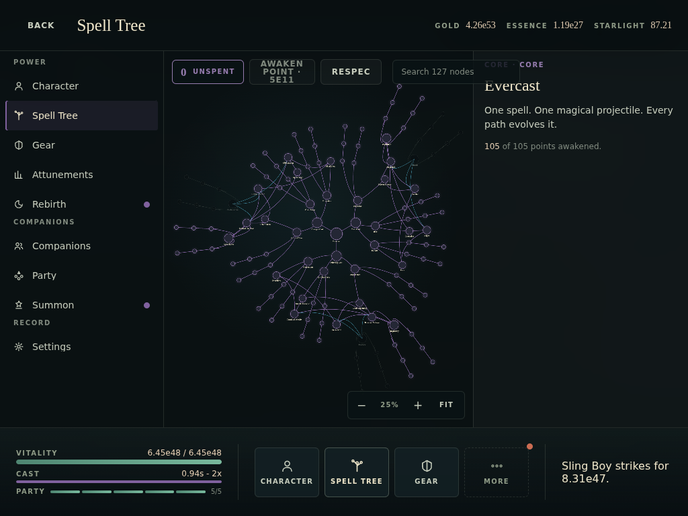

**(b) The nodes are far too small to aim at.** Node sizes are authored in world
units — `minor: 26`, `mutation: 44`, `identity: 50`, `root: 72` — and then
scaled by the fit. Measured on-screen widths of live node buttons at the
default zoom:

| Viewport | Scale | Root (72u) | Route (60u) | Identity (50u) | Minor (26u) |
| --- | --- | --- | --- | --- | --- |
| 1920x1080 | 0.44 | 32px | 27px | 22px | **12px** |
| 1280x800 | 0.29 | 21px | 18px | 15px | **8px** |
| 1024x768 | 0.25 *(clamped)* | 18px | 15px | 13px | **6px** |
| 820x1180 touch | 0.36 | 26px | 22px | 18px | **10px** |
| 1180x820 touch | 0.31 | 22px | 18px | 15px | **8px** |
| 390x844 touch | 0.25 *(clamped)* | 18px | 15px | 13px | **7px** |
| 844x390 touch | 0.25 *(clamped)* | 18px | 15px | 13px | **7px** |
| 320x568 touch | 0.25 *(clamped)* | 18px | 15px | 13px | **7px** |

Measured with `getBoundingClientRect()` on the live node buttons at the
default (fitted) zoom; `u` is the authored size in `spellTreeGraph.ts`. **Not
one node at any viewport reaches 44px**, and the largest thing on the screen —
the root — tops out at 32px on a 4K-class desktop.

63 of the 127 nodes are `minor`. The project sets `--touch-target: 44px` and
honours it everywhere else; the one screen with 127 targets ignores it
entirely. On a coarse pointer a 6px target is not a small target, it is not a
target.

**(c) The minimap is switched off exactly where it is needed.** `.minimap` is
`display: none` under `max-width: 860px`, with the rationale that it would
cover a quarter of a phone viewport. That rationale is sound and the
conclusion is backwards: on a phone the graph *does not fit*, so the minimap
is the only thing that could tell you a tree exists outside the frame. On a
1440px desktop, where it is shown, the tree does fit and it is redundant.

**Related, same screen:**

- The floating toolbar sits *over* the graph on wide layouts, so nodes under
  it (`Contagion`, `Blight` at 1440x900) are covered and unclickable.
- The zoom cluster (`− + Fit`) floats over the bottom-right of the graph and
  covers nodes there.
- Labels render at every zoom. At the fitted 25-35% they are 3-4px of noise;
  there is no level-of-detail rule.
- On a phone the toolbar row scrolls horizontally with `scrollbar-width: none`
  and no gradient, so `Respec` is cut mid-word and the search field is
  entirely off-screen with nothing saying so.

**Fix sketch.** Drop the fit clamp (let `fitToBounds` go below `min` when the
graph genuinely needs it, and clamp only *user* zoom); give nodes a minimum
hit area independent of visual size (a transparent padded button, or a
`pointer-events` overlay sized `max(44px, visual)`); show the minimap when the
graph overflows rather than by breakpoint; move the toolbar out of the graph's
own box on wide layouts, or inset the graph bounds by the toolbar height; hide
labels below ~50% zoom and show the selected node's label always.

---

### BLK-3: the Gear buy control is below the fold on a phone

**Severity S1. 390x844, 360x800, 320x568. Both `fresh` and `late` saves.**

`Detail` gives the list a `max-height: 45%` band and the pane the rest. On a
390x844 phone, once the header (56px), the rail strip (61px), the list band
(~310px) and the shelf (168px) are taken, the pane has roughly 230px. The
pane renders, in order: eyebrow, name, description, three fact rows, **then**
the buy block. The buy block — the quantity selector, the button and the price
— falls past the bottom edge in every state tested. The last thing visible is
the word `BUY`, itself clipped by the shelf.


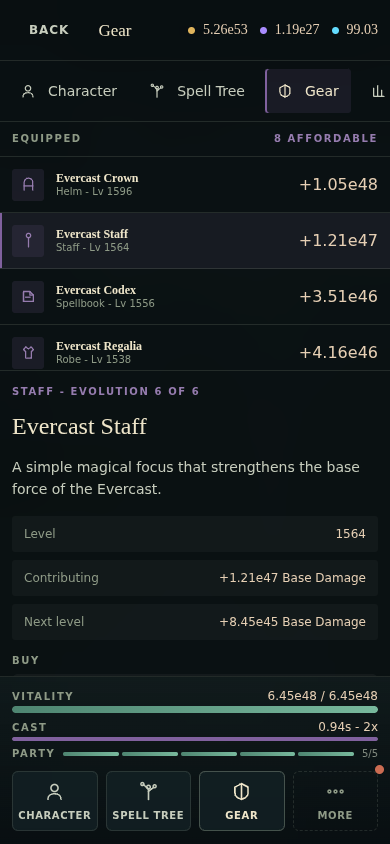

Nothing indicates that the pane scrolls: no fade, no shadow, no partial row
peeking, and the scrollbar is suppressed on coarse pointers.

Buying gear levels is the primary verb of the game's primary economy. On a
phone it is invisible until the player guesses to scroll a pane that gives no
sign of being scrollable.

**Fix.** The buy affordance should be pinned to the bottom of the pane on
short viewports (a sticky action bar is the standard answer and fits the
existing archetype), and every archetype scroll container should carry a
bottom fade whenever it has hidden content. Ordering the pane
*action-first* on narrow layouts would also work.

---

### BLK-4: the first frame after Continue blocks for seconds

**Severity S2 (S1 on a slow phone). All viewports.**

`GameLoop.step` settles the entire away debt on the first frame, synchronously:
`OfflineProgressor.apply` advances the simulation by up to
`OFFLINE_SAMPLE_SECONDS` (600s) in one call before the frame returns. The
cost is bounded — which is the right design — but it is *paid in one block*,
after the gate has already been dismissed and the player believes the game has
started.

Measured with `PerformanceObserver({entryTypes:['longtask']})` on the `late`
save, from the Continue click:

```
long tasks over 100ms: 1334ms, 108ms, 1778ms, 1983ms
welcome-back moment appeared 5,961ms after the click
```

(CPU-bound work, so the software rasteriser does not invalidate this; the
absolute numbers will be smaller on a fast desktop and larger on a phone.)

Two visible consequences:

- The interface is frozen for several seconds immediately after the player
  first touches it. Nothing says so — the gate is already gone.
- Layout-dependent state measured during that window comes out wrong. This is
  reproducible: opening the spell tree inside the stall gave a `ResizeObserver`
  viewport of `{0,0}`, so the graph rendered at the identity transform (100%,
  cropped, minimap incorrectly shown) instead of fitted. After the stall it
  fitted correctly at 35%.

**Fix.** Keep the gate up, or show an explicit "catching up" state, until the
settle completes; or slice `OfflineProgressor.apply` across a few frames with
the gate showing progress. The comment in `settleAway` argues for one go
because a player command must not land mid-settle — that is still satisfiable
if the gate has not lifted yet.

---

## 5. Layout and responsive behaviour

### LAY-1: surfaces do not use the screen

Every archetype is `align-content: start` inside a scroll container, with no
maximum content width and no strategy for a screen larger than the content.
The result is that the game looks *unfinished* on the most common desktop
sizes, and *cramped* on the largest.

Measured with the `late` save (a fully-built account — a fresh one is emptier
still):

| Surface | 1440x900 | What is below the content |
| --- | --- | --- |
| Character | content ends ~y=585 of 768 | ~24% black |
| Gear | content ends ~y=570 | ~26% black |
| Attunements | content ends ~y=440 | **~43% black** |
| Rebirth | card ends ~y=600, and the card is 560px wide of 1440 | ~22% black + 61% unused width |
| Summon | content ends ~y=710; the aside ends at y=215 | aside column ~72% empty |
| Party | "Replace with" grid clipped mid-row at the fold | — |

At 1920x1080 the same surfaces get *worse*, because `.stats` is
`repeat(auto-fill, minmax(190px, 1fr))` and the equipment grid follows the
same pattern: extra width becomes **more columns**, not wider ones. At
1920x1080 the Character equipment list shows four columns and ellipsises the
item names — `Evercast Code…`, `Evercast Sign…`, `Evercast Crown Lv …` — while
500px of the row and 600px of the viewport sit empty.


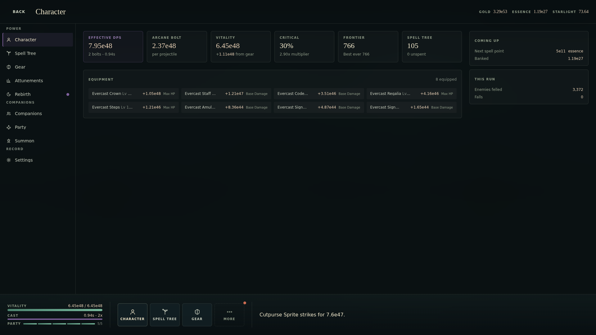

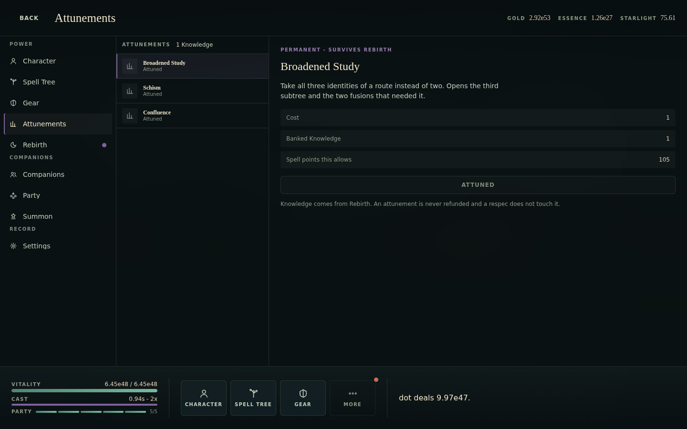

This is the single biggest "does not feel AAA" signal in the product. A
player's first impression of Character or Attunements on a laptop is a mostly
empty black rectangle.

**Fix directions.** A `max-width` on the reading column plus centring; let the
aside collapse into the main column when it has under N items; use the spare
height for the things the game currently has nowhere to put (a real event log,
a DPS-over-time strip, a "best next purchase" panel, zone progress); and cap
`auto-fill` column counts so extra width widens cells instead of adding them.

### LAY-2: the shelf vitals wrap between 621px and 860px

At `max-width: 860px` `Shelf.module.css` sets `.vitals { width: 180px }`,
while the shelf is still a single row (the column layout only starts at
620px). The vitality readout at late game is `6.45e48 / 6.45e48` — seventeen
tabular characters — and with the `VITALITY` label beside it the head does not
fit 180px. Observed at 820x1180: the readout wraps to a second line and the
meter track is pushed into the `CAST` row below it.


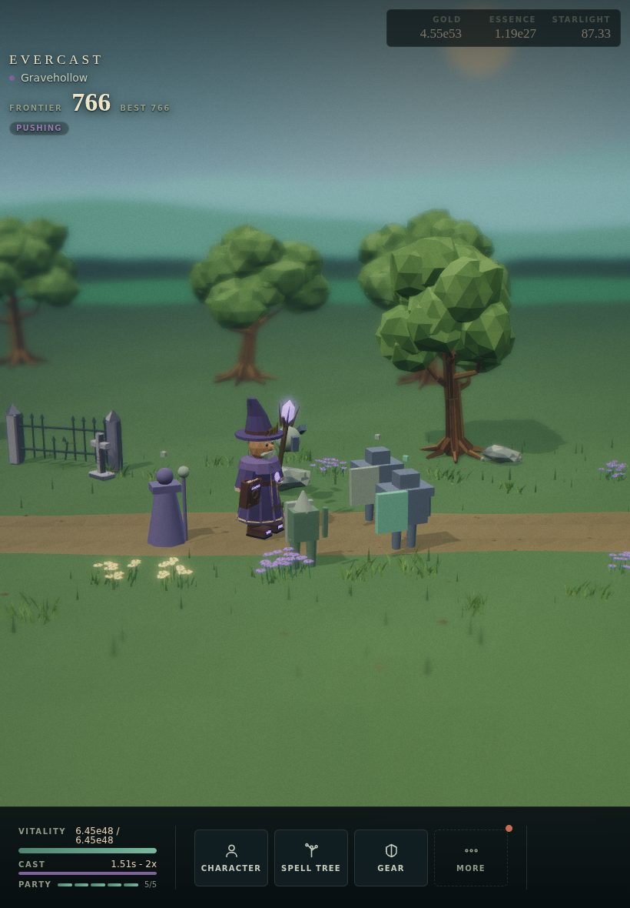

The band 621-860px is real hardware: iPad mini portrait (744), iPad portrait
(810/820), Surface Duo, many Android tablets, and any half-screen desktop
window. It also catches **landscape phones under 860px wide** — the landscape
rule sets `.vitals { width: 160px; flex: 1; max-width: 240px }`, and at
568x320 the readout wraps there too.

### LAY-3: two stacked scroll regions with no affordance

On every `Detail` surface below 860px the list band and the pane are separate
scroll containers, stacked. Neither has a scroll affordance: no fade, no
shadow, no scrollbar (`scrollbar-width: none` on the rail, and coarse pointers
hide it elsewhere), and rows are cut *exactly* at the container edge rather
than deliberately half-showing the next one.

Measured cut-off rows (interactive elements straddling the fold):

| Viewport | Surface | Element |
| --- | --- | --- |
| 1920x1080 | Companions | roster row `Cutpurse Sprite` at y=1049-1101 |
| 1280x800 | Companions | roster row `Thicket Stalker` at y=789-841 |
| 1024x768 | Party | two `Replace with` cards at y=731-781 |
| 1180x820 | Party | two `Replace with` cards at y=814-865 |
| 820x1180 | Party | four `Replace with` cards at y=1170-1221 |
| 390x844 | Companions | roster row `Tallow Chirurgeon` at y=831-887 |

### LAY-4: the list band is 45% of the height whatever is in it

`Detail`'s `.list` takes `max-height: 45%` below 860px and a fixed `320px`
above it, regardless of content. Consequences seen:

- **Attunements** has three rows. On desktop it reserves a 320px column and
  700px of empty vertical space for them.
- **Party** has five rows. Same.
- **Companions with no companions** (`fresh` save, phone) reserves 45% of a
  844px screen — around 310px — to display the two words `Nobody yet.`, and
  then the pane below it says the same thing again in a heading.
- **Settings** has three rows and reserves the same 320px column.

### LAY-5: the diorama is framed for one aspect ratio

The camera composition is fixed, so the same scene is:

- **Phone portrait (390x844):** a ~100px band of action in the middle of a
  480px-tall viewport, the mage roughly 40px tall, most of the frame empty
  grass and sky.
- **Tablet portrait (820x1180):** the same, worse — the action band occupies
  under a fifth of the height.
- **Landscape/desktop:** correct, and clearly what it was composed for.

Enemies also approach from a world x that is outside the visible frustum on
narrow aspects, so on a phone an encounter can be announced in the log
(`Briarling enters (2/4).`) with nothing yet visible on screen.

A vertical FOV or camera-distance adjustment driven by aspect ratio would fix
all three.

### LAY-6: the landscape-phone gate is right, and its floor is exposed

`SurfaceHost` restores the wide layout at `max-height: 520px and min-width:
640px and (orientation: landscape)`, and the comment explaining the 640px
floor is exactly correct reasoning. The consequence is worth stating anyway:
**below 640px wide in landscape the game falls back to the stacked phone
layout on a 320px-tall screen.** Measured at 568x320 on the Character surface:
header 46px + rail strip 61px + shelf 84px = 191px of chrome, leaving ~129px
of pane — one row of stat cards, cut through the middle, above a scroll region
with no affordance. That is a real, if old, device class (iPhone SE 1st gen
and every 320x568 Android held sideways).

---

## 6. Navigation and information architecture

### NAV-1: More is a dead end, not a menu

`Shelf.onOpenMore` does this:

```ts
const firstOverflowId = layout.overflow[0]?.id ?? layout.pinned[0]?.id ?? null;
onOpenMore={() => firstOverflowId && onOpen(firstOverflowId)}
```

Pressing **More** does not open a menu of the things behind it. It opens
*whichever destination happens to be first in the overflow list* — currently
Companions — and relies on the player then noticing the nav rail inside that
surface. The button is labelled `More` and badged with the merged badge of
everything behind it, which sets the expectation of a menu.

Consequences: the badge on More can be for Rebirth while pressing it lands you
in Companions; there is no way to see the full destination list without
entering a surface you did not ask for; and on a phone, where the rail is a
horizontally-scrolling strip, the destination you wanted may not even be
visible after the jump.

### NAV-2: the rail never shows where you are

`NavRail` has no scroll-into-view behaviour. Below 860px the rail is a
horizontal strip with `scrollbar-width: none` and no edge fade. So:

- Opening **Settings** (last in the rail) on a 390px phone shows a strip
  containing Character, Spell Tree, Gear, Attunements… and **no highlighted
  entry at all**, because the current one is off-screen to the right.
- There is no visual signal that the strip scrolls. Measured at 390x844, the
  rail's own content box is 625px wide inside a 390px viewport — it is
  scrollable by 235px with nothing indicating it.
- At 820x1180 the entry at the right edge is cut through the middle of its
  label — measured, the `Party` label spans x=828-864 on an 820px viewport.

### NAV-3: no keyboard route into anything

The only key the interface binds outside a dialog is Escape (`useEscape`).
There are no shortcuts to open Character / Spell Tree / Gear, no `Tab`-group
cycling, no number keys, no `?` help. `EvercastScene` binds `N` / `Shift+N`
but only in development, for biome preview.

For a game that is played in a browser window for hours at a time, on a
desktop, with the whole interface made of buttons, that is a notable gap —
and the focus-ring work already done in `reset.css` means the groundwork is
there.

### NAV-4: pinned destinations are not actually pinnable

`DEFAULT_PINNED = ['character', 'spell-tree', 'gear']` is a module constant
passed straight into `shelfLayout`. The signature (`pinnedIds` as "a user
preference") anticipates customisation, but nothing writes it and there is no
UI for it. A player whose loop is Companions/Party/Summon pays the More
detour every time.

### NAV-5: no back stack

The game is a single route. There is no history entry per surface, so the
browser Back button leaves the game rather than closing a surface — on Android
that is the system back gesture, which is the way most phone users expect to
dismiss a full-screen panel. There is also no deep link (`#/gear`), so no way
to bookmark or share a screen, and no way to restore the last open surface
after a reload.

---

## 7. The HUD and game feel

### HUD-1: the encounter is invisible unless it is a boss

`HudOverlay` gates the whole enemy block on `phase === 'combat' && boss`:

```tsx
{phase === 'combat' && boss && (
  <div className={styles.enemy}> … enemy name, HP meter, "{alive} alive - {spawned}/{total} spawned" … </div>
)}
```

So for every ordinary encounter — which is nearly the whole game — the HUD
shows **no enemy name, no enemy health, and no wave progress**. The only
readouts of the fight are a small world-space health bar floating over the
enemy mesh (10px text, over a bright scene) and the single log line.

On a phone that world-space bar is a few pixels of text over grass. The
snapshot already carries `encounterAliveEnemies`, `encounterSpawnedEnemies`
and `encounterTotalEnemies`; they are simply never drawn outside a boss fight.

### HUD-2: the log is a single line, and disappears below 860px

`ShelfLog` renders `snapshot.lastEvent` — one line, no history, no scrollback.
`Shelf.module.css` then does `@media (max-width: 860px) { .log { display: none } }`.

So on **every phone and every portrait tablet the event log does not exist**.
That is a bigger loss than it looks:

- The log is the only place the game narrates itself in words.
- `AppShell` explicitly documents the log as the accessible counterpart to the
  canvas ("the shelf log narrates what happens as it happens"). On a phone the
  `role="img"` canvas points at a description that is not rendered, so a
  screen-reader user on a phone gets no running commentary at all.
- It is also the only way to learn that a companion went down, that a gear
  piece evolved, or that the mage died.

On desktop, where it *is* shown, one line is still too little: at late game
the simulation produces several events per second, so the line flickers
through text far faster than anyone can read it. There is no pause, no
history, no filter, and no way to review what happened while a surface was
open.

### HUD-3: no rate anywhere

For an incremental game, the numbers that decide every decision are rates and
times-to-afford, and none are shown:

- no gold per second, essence per second or starlight per second
- no "time to next spell point"
- no "time to afford this gear level"
- no DPS-over-time or damage-taken trend
- no stage-per-hour or progress-toward-next-zone

`OverviewSurface` shows `Effective DPS` (good), and `Coming up` shows the next
spell-point price against the banked balance — but not how long that will
take. The player cannot answer "is this purchase worth it?" without doing
arithmetic against numbers in `e`-notation.

### HUD-4: damage numbers pile up
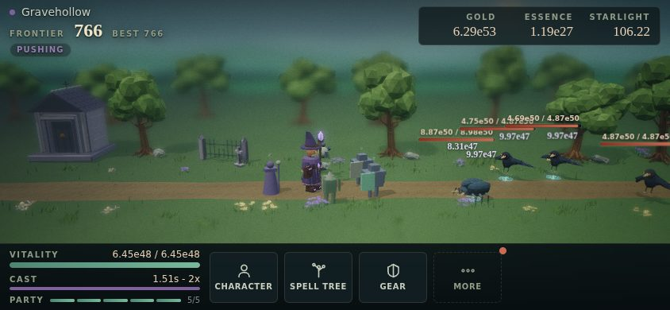


At late game with two projectiles, pierce, chain and a DoT, `DamageNumbers`
emits several figures per cast at roughly the same world position. In the
1440x900 capture, four values (`1.23e48`, `3.44e47`, `9.97e47`, `3.32e49`)
overlapped into an unreadable stack directly on top of the enemy's own health
bar. There is no aggregation, no jitter budget, no stacking rule and no cap
per target per tick beyond the pool size.

### FEEL-1: death is invisible

The mage falling is the only failure state in the game. What the player gets:

- one log line, `The mage falls at stage 767.`, which is replaced by the next
  event within a second (and does not exist at all below 860px), and
- the mode pill quietly changing from `PUSHING` to `FARMING 766`,
- plus a `Retry Frontier` button appearing beside the wallets.

There is no screen, no sound cue called out in the UI, no shake, no summary of
what killed you. `Moment` exists for exactly this — `WelcomeBack`'s own doc
comment describes it as "the same component the defeat and rebirth screens
use", and **there is no defeat screen**. A new player's first death is
therefore: a button they were not told about appears, labelled `Retry
Frontier`, next to a pill that now says `FARMING 4`, with no explanation of
either.

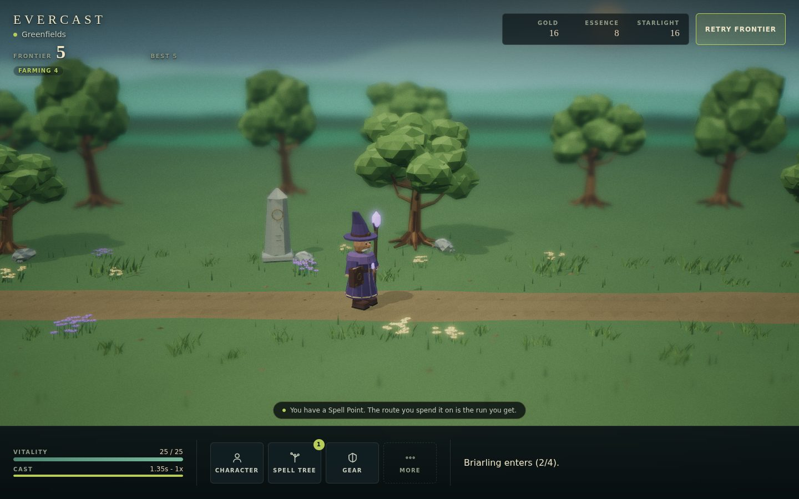

### FEEL-2: Rebirth is irreversible and unconfirmed

Rebirth resets the run to Frontier 1. It is a single button press with no
confirmation step, while **Erase progress** — which is comparable in
consequence — has a full danger `Moment` with a `Keep my run` escape and
`data-autofocus` pointed at the safe option. The screen also does not itemise
what is lost versus kept beyond one paragraph of prose; there is no list of
"105 spell points reset / gear levels kept / 25 companions kept / Frontier 766
to 1".

### FEEL-3: respec is the same

`Respec` sits in the spell-tree toolbar as an ordinary secondary button. At
late game it undoes 105 point allocations, instantly, with no confirmation and
no undo. A misplaced tap on a phone toolbar that scrolls horizontally is a
plausible way to lose a build.

### FEEL-4: the HUD and the world name different places

`WorldGenerator.rawBiomeSample(distance)` picks the rendered biome by **travel
distance**, wrapped over a fixed cycle. `ui/theme/biome.ts` picks the accent
and the HUD picks its label from **`snapshot.zoneName`**. The two are not
synchronised, and `biome.ts` says so in a comment.

Observed on the `late` save: the HUD read `Gravehollow` with the purple
Gravehollow accent, over a scene with bright green grass, green canopy trees
and a blue-green sky — Greenfields terrain, with Gravehollow props (mausoleum,
gravestones, bone piles) scattered through it. The interface and the world are
telling the player two different things about where they are.

### FEEL-5: no reward beat for anything but a summon

The game has exactly one celebration: the summon reveal. Nothing marks

- a gear piece evolving into a new tier (six tiers, eight slots — 48 events),
- a rebirth completing,
- entering a new zone,
- a capstone/apex spell node being awakened,
- a new best frontier,
- a companion reaching a new star level.

All of them are log lines. For a game whose entire loop is "numbers get
bigger", the moments where something *qualitatively* changes are the ones
worth staging, and none of them are.

---

## 8. Surface-by-surface

### SUR-BOOT: the boot gate

Good: it is one screen doing three jobs (title, loading, audio gesture), the
button is focused the moment it becomes pressable, `inert` keeps the world
behind it unreachable, and the 8s ceiling stops it being a trap.

Gaps:

- There is **no way to reach Settings from the gate**. A returning player who
  wants to mute before the music starts has to press Continue first — which is
  precisely the gesture that starts the audio.
- There is no version string, no build id, no link to anything. A shipped game
  needs at least a version for bug reports.
- There is no "start a new run" affordance for a player who wants one; that
  lives four levels deep in Settings → Account → Erase.
- The sigil is cropped by the viewport on a phone (it is wider than 390px), so
  the composition reads as an accidental crop rather than a vignette.
- `aria-busy` and the changing label carry the wait, which is good, but there
  is no progress at all. On a cold load the ceiling is 8 seconds, and
  "Gathering the world" with a static line under it is a long time to show
  nothing — especially as the same wait is charged again, invisibly, after the
  button is pressed (see [BLK-4](#blk-4-the-first-frame-after-continue-blocks-for-seconds)).

### SUR-CHR: Character

- The single biggest instance of [LAY-1](#lay-1-surfaces-do-not-use-the-screen):
  at 1440x900 the content ends around 585px of 768 and at 1920x1080 it ends
  around 380px of 940, while item names ellipsise.
- **Numbers do not line up.** Each equipment row renders
  `<NumberCell>+1.05e48</NumberCell><span>Max HP</span>`, and the stat label
  is different lengths (`Max HP` vs `Base Damage`), so the *numbers* end at
  different x positions down the column. The whole point of `--value-width`
  and `tabular-nums` is defeated by putting a variable-width suffix after the
  reserved cell. See [TYP-2](#typ-2-numbers-are-not-actually-aligned).
- **Truncation cuts the wrong thing.** `Row.label` holds
  `{name}<span> Lv {level}</span>` inside one ellipsised span, so on a phone a
  row reads `Evercast Codex Lv 15…` — the level, which is the number that
  changes, is what gets cut.
- Two rows read `Evercast Signet` with no way to tell Ring I from Ring II
  ([TXT-3](#txt-3-two-rings-with-the-same-name)).
- The equipment panel shows contribution but not *cost*, so it cannot answer
  "what should I buy next", which is the question the screen exists for.
- `Coming up` and `This run` are four numbers in a 24rem column beside 600px
  of black.

### SUR-TREE: Spell Tree

Covered in [BLK-2](#blk-2-the-spell-tree-cannot-be-fitted-or-aimed-at). Beyond
the blocking issues:

- The inspector header reads `CORE · CORE` for the root node — kind and region
  are both `core`, and nothing de-duplicates them.
- Nothing is selected on arrival except the root, so the 320px inspector opens
  showing three lines of flavour text. On a wide screen that is 22% of the
  width doing nothing.
- The toolbar chip `0 unspent` is a read-out, but it is 36px tall with a 1px
  border and a card radius sitting in a row with two 38px bordered buttons, so
  it reads as a third button that happens to do nothing when pressed.
- `Awaken point · 5e11` puts the price in the button label with no indication
  of the balance, so affordability has to be read from the disabled state.
- There is no legend. Node fill encodes status (`--accent` active, `--route`
  available, `--ink-dim` otherwise), edges encode three tones, and ring radius
  encodes tier — none of it is explained anywhere.
- There is no filter for "available now", which on a 127-node graph is the
  single most useful view.

### SUR-GEAR: Gear

- [BLK-3](#blk-3-the-gear-buy-control-is-below-the-fold-on-a-phone).
- The list shows contribution, not price, so choosing what to level requires
  opening each slot in turn. Eight slots, one at a time.
- No damage-per-gold or "best value" hint, and no way to sort.
- `1x / 10x / Max` sit in the same row as the `Buy` eyebrow rather than beside
  the button they modify, so the multiplier and the thing it multiplies are
  visually unrelated. (They are correctly raised to 44px on touch.)
- At the final tier the Evolution panel shows six full bars and `Final tier`
  and says nothing else; the pane below it is empty for ~200px at 1440x900.
- The fact rows (`Level`, `Contributing`, `Next level`) stretch the full pane
  width, so at 1440px there are ~700px of empty leader between the label and
  the value.

### SUR-COMP: Companions
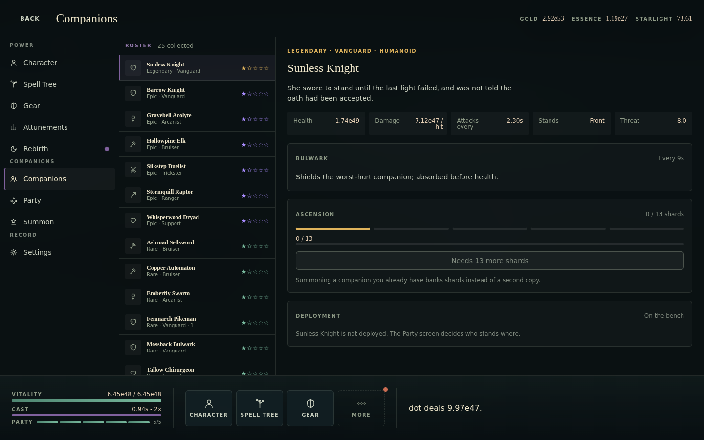


- **No art.** Every one of 30 companions across five rarities is a 17px class
  glyph in a 32px rounded square. The roster is the collection screen of a
  gacha game and it reads as a settings list. `modelKey` exists as the seam
  for real art; the roster has no seam at all.
- **Rarity is nearly invisible.** It appears as the colour of the star glyphs
  and as a word in the 10px sub-label. The row itself — background, border,
  name colour — is identical for Common and Legendary.
- **Two representations of the same fact on one screen**: the roster shows
  stars (`★☆☆☆☆`), the detail pane shows the same thing as five pip bars.
- **No sort, no filter, no search** for a 30-strong roster. Not by rarity, not
  by class, not by "deployed", not by "can ascend".
- The `Damage 7.12e47 / hit` fact wraps mid-value at 1440px — `/ hit` drops to
  a second line inside a one-line cell, so that column sits taller than its
  neighbours. At 320px it is worse: `.facts` is
  `repeat(auto-fit, minmax(min(100%, 9rem), 1fr))`, which resolves to two
  ~148px columns, while a `.fact` needs its label plus a 10ch `NumberCell`
  plus padding — around 177px. The cell overflows its own track and is then
  clipped by the pane's `overflow-x: hidden`, so the row reads
  `Damage  7.12e47 /` with the unit cut off. The remaining three facts are
  below the fold.
- Ascension state is stated three times: panel note `0 / 13 shards`, meter
  readout `0 / 13`, button `Needs 13 more shards`.
- `Fenmarch Pikeman · Rare · Vanguard · 1` — the trailing `1` is the party
  slot, with nothing saying so.

### SUR-PARTY: Party
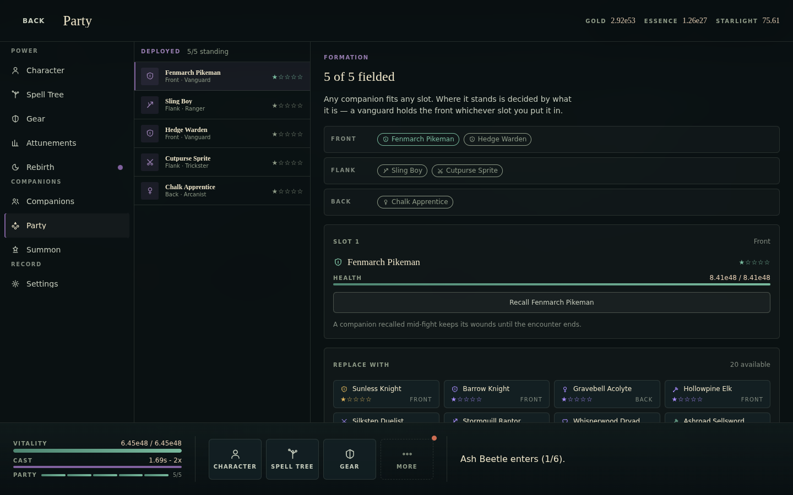


- The **Formation block is read-only**. Front/Flank/Back are rendered as rows
  of chips, but the arrangement cannot be touched; assignment happens through
  a separate `Replace with` grid below. A formation screen that draws a
  formation and does not let you move anything in it is the wrong affordance.
- The relationship between `Slot 1…5` and Front/Flank/Back is never explained
  on screen beyond one sentence, and the slot detail says `SLOT 1 … Front`
  while the Front row above contains two companions. Two different mental
  models on the same screen.
- The `Replace with` grid is always clipped at the fold (measured at 1024x768,
  1180x820, 820x1180 and every phone) with no affordance.
- The deployed list reserves its full band for five rows, leaving ~380px of
  dead space on desktop.
- `Recall Fenmarch Pikeman` is an ambiguous verb — it reads as "call them
  back to fight" rather than "remove them from the party".

### SUR-SUMMON: Summon

- **The draw buttons do not look like buttons.** `.draw` is `--veil-3` on a
  `--line-strong` border — the same visual weight as the `Starlight` and
  `Pity` stat cards directly above them. The two most important actions on the
  screen are styled as read-outs. The disabled state only changes the text
  colour, so affordable and unaffordable look nearly identical.

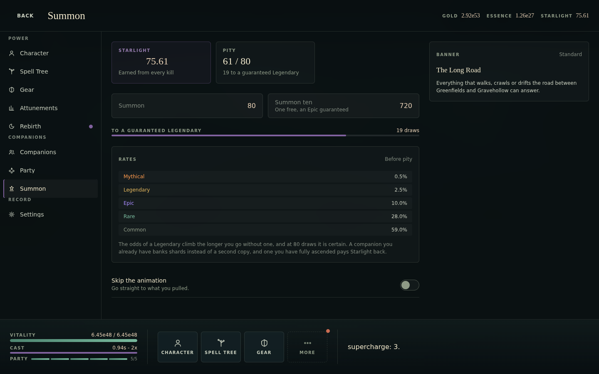

- **The banner is a text card in the aside**, 390px wide, with ~500px of empty
  column beneath it. In a game with a summon economy the banner is the screen;
  here it is a footnote.
- Pity is stated twice: the `Pity 61 / 80` stat card with
  `19 to a guaranteed Legendary`, then a full-width meter labelled
  `To a guaranteed Legendary … 19 draws` immediately below it.
- `Skip the animation` duplicates Settings → Display → `Skip summon
  animation`, with different wording.
- The ten-pull says `One free, an Epic guaranteed` but does not show the
  saving (720 against 800).

### SUR-REVEAL: the summon reveal

- **A single-pull reveal is broken on desktop.** `.cards` is
  `repeat(auto-fit, minmax(min(100%, 8.5rem), 1fr))` with `max-width: 56rem`,
  so one result collapses to a single 896px column, and `.card`'s
  `aspect-ratio: 3 / 4` with no `max-height` makes that card taller than the
  window. Measured live at 1440x900 after a single draw:

  ```
  scrim   0,0    1440x768   position: fixed
  card    272,-537  896x1195
  ```

  The card starts 537px **above** the top of the overlay and runs 658px below
  it, so it is clipped at both ends with its four lines of content stranded
  near the top edge and ~600px of empty card below them. A single draw is the
  common case.
- **The reveal does not cover the shelf.** `.scrim` is `position: fixed;
  inset: 0`, but the reveal renders inside `SurfaceHost`, and `.host` sets
  `backdrop-filter: blur(18px)` — which makes it a containing block for fixed
  descendants. So the "fixed" scrim measures 1440x**768** on a 900px viewport:
  it stops exactly at `var(--shelf-inset)`. Measured with the reveal open, the
  shelf's first button is the topmost element at its own centre, and
  Playwright clicks it successfully. The result is an `aria-modal="true"`
  overlay with the nav bar lit and reachable underneath it. (`useDialog` traps
  Tab, so this is a pointer-only hole — the same class of bug `inert` was
  introduced to fix on the boot gate.)

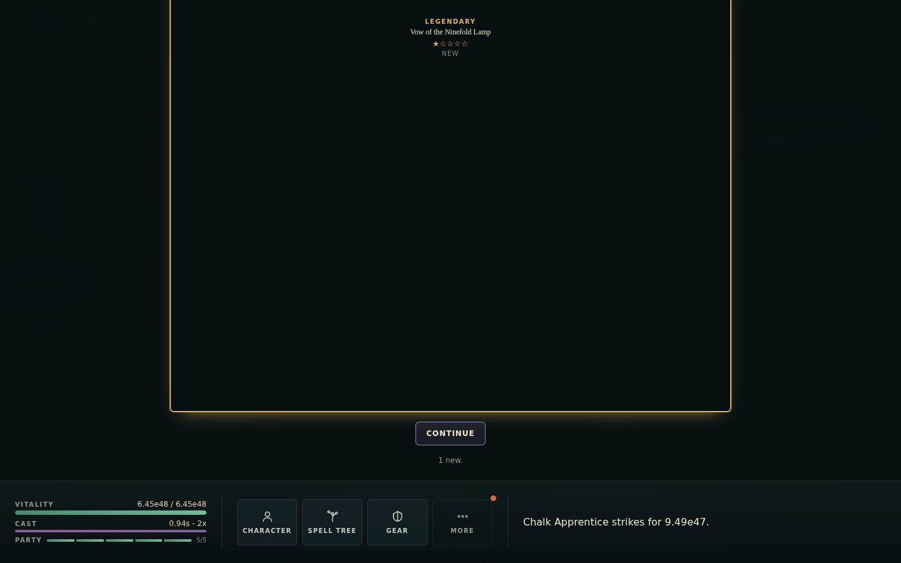

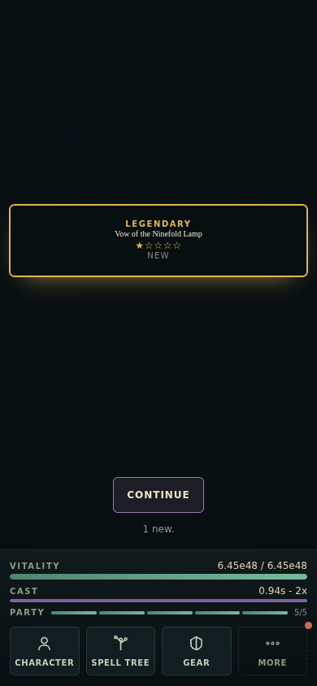

- A Legendary — 2.5% base — is a thin outlined rectangle with four lines of
  10-12px text. No art, no burst, no distinct treatment beyond a border
  colour. On phone it is an 88px-tall box in the middle of an empty screen.
- `Continue` sits roughly 300px below the card on a phone because the scrim's
  `grid-template-rows: 1fr auto auto` pushes the actions to the bottom.

### SUR-ATT: Attunements

- Three rows, a 320px list column and ~700px of empty pane. The whole surface
  could be three cards in the Rebirth screen.
- `Cost … 1` and `Banked Knowledge … 1` are single digits at the far right of
  an 820px row.
- Nothing shows what each attunement *unlocks* in the tree — the copy says
  "opens the third subtree and the two fusions that needed it" but there is no
  link to the tree and no highlight of the nodes concerned.

### SUR-REB: Rebirth

- [BLK-1](#blk-1-the-rebirth-surface-traps-the-player) and
  [FEEL-2](#feel-2-rebirth-is-irreversible-and-unconfirmed).
- The `Mastery x15.36` cell and the hint sentence state the same number twice.
- A 560px card on a 1440px screen with ~60% of the width and ~22% of the
  height unused.

### SUR-SET: Settings

Good: the `Field` shape is consistent, `Erase` has a proper danger
confirmation focused on the safe option, the audio preview button is a genuinely
thoughtful touch, and the privacy copy is in the game rather than only in a
document.

Gaps — see [A11Y-4](#a11y-4-no-in-game-accessibility-settings). Also:

- Three sections in a 320px list column with the same dead-space problem.
- The `Display` section uses the `statistics` (bar-chart) icon and `Account`
  uses the `character` (person) icon; neither is about what it labels.
- At 360x800 the last toggle sits below the fold with no affordance.

---

### SUR-SHORT: the pattern behind three of these

On every short viewport (phone landscape, and phone portrait for the taller
surfaces), **the primary action of a `Detail` surface falls below the fold**.
`Detail`'s pane renders eyebrow → name → description → facts → action, and
nothing pins the action. Measured at 844x390 with the `late` save:

| Surface | Visible | Below the fold |
| --- | --- | --- |
| Gear | name, description, 2.5 fact rows | quantity selector, **Level up**, price, evolution |
| Companions | name, description, 2.5 fact rows | ability, ascension track, **Ascend**, deployment |
| Party | formation chips | slot detail, **Recall**, the whole `Replace with` grid |
| Settings | heading, blurb, 2 fields | the remaining fields |


Also at 844x390 the Gear list column is 240px, so every row truncates to
`Evercast…` with a truncated sub-line (`Helm - L…`, `Spellboo…`). Eight rows
that cannot be told apart by name.

---

## 9. Typography, colour and iconography

### TYP-1: the game ships no fonts

`--font-display: Georgia, 'Times New Roman', serif` and
`--font-ui: Inter, ui-sans-serif, system-ui, …`, and neither family is in the
repository. Georgia exists on Windows and macOS and essentially nowhere else;
Inter is installed by almost nobody by default. So:

- **Windows/macOS**: Georgia + (usually) system-ui, roughly as designed.
- **Android** (a large share of the mobile audience): no Georgia, no Inter →
  Noto Serif + Roboto, with different widths and a different voice.
- **Linux**: DejaVu Serif + DejaVu Sans.

The tracking values are tuned for specific letterforms —
`letter-spacing: 0.34em` on the gate wordmark, `0.26em` on the HUD wordmark,
`0.16em` on every micro-label — and those are the declarations most sensitive
to a substituted face. The game's whole visual identity is "parchment serif
over deep pine", and on a phone it is likely not the serif that was chosen.

The CSP already allows `font-src 'self'` and the privacy note is explicit that
nothing comes from a CDN, so self-hosting two woff2 subsets is fully
compatible with the project's constraints — it is the single highest-leverage
polish change in this document.

*(This also means the wrapping measurements in this audit are approximate; see
[section 1](#1-how-this-was-measured).)*

### TYP-2: numbers are not actually aligned

`NumberCell` reserves `--value-width: 10ch` and uses `tabular-nums`, and
`tokens.css` states the rule as "numbers are tabular and right-aligned
everywhere, without exception". Three patterns break it:

1. **A suffix after the cell.** `OverviewSurface` renders
   `<NumberCell/><span>{primaryStatLabel}</span>`, so `+1.05e48 Max HP` and
   `+3.51e46 Base Damage` put their numbers at different x positions in the
   same column.
2. **A suffix inside the cell.** `GearSurface` passes
   `suffix={' ' + primaryStatLabel}` into `NumberCell`, which right-aligns the
   *suffix*, not the number — same outcome for a different reason.
3. **`inline` everywhere.** `inline` drops `min-width`, and it is used for
   every value in the HUD wallets, the surface header wallets and several stat
   cards. Those are the fastest-changing numbers in the game, and they are the
   ones with no reserved width.

The fix is a two-part cell — a fixed-width numeric part and a separate unit
part — so the unit can be left-aligned in its own column.

### TYP-3: hyphens doing the work of dashes

The interface uses `-`, `·` and `—` interchangeably for the same job:

| Where | Separator |
| --- | --- |
| `Awaken point &middot; 5e11` | `·` |
| `Kind &middot; Region` (tree inspector) | `·` |
| `Rare · Vanguard · 1` (companion row) | `·` |
| `Helm - Lv 1596` (gear row) | `-` |
| `2 bolts - 0.94s` (stat detail) | `-` |
| `0.84s - 2x` (shelf cast meter) | `-` |
| `Staff - Evolution 6 of 6` | `-` |
| `Locked by your choices - respec to change` | `-` |
| `Awaken - 1 point` | `-` |
| `it is — a vanguard holds the front` | `—` |
| `${entry.name} — down` (party chip title) | `—` |

A hyphen between two phrases is a typographic error rather than a preference;
it is also the one thing a reader notices as "amateur" without being able to
say why. Pick `·` for compound labels and `—` for parenthetical clauses and
apply it once.

### TYP-4: no number-format choice

Everything is scientific notation (`6.45e48`, `1.19e27`, `7.56e47`).
`formatMagnitude` is well built — it never exceeds ten characters at any
magnitude, which is what makes the reserved width work — but incremental
players expect a choice, usually between scientific, engineering, and
letter/standard notation (`K M B T aa ab`). There is no setting.

Separately, **Starlight is displayed fractionally**: the HUD showed `75.61`,
`87.33`, `106.22` against a summon price of `80`. A premium collection
currency with two decimal places reads as a bug to a player even when the
economy intends it.

### COL-1: the palette is well-governed and under-used

The closed token set and the `--accent` / `--accent-ink` split (chrome owes
3:1, text owes 4.5:1) are genuinely excellent, and `accessibility.test.ts`
computes the ratios rather than asserting a vibe. What the palette is not
doing:

- **Rarity barely shows.** `--rarity` is set per row but only reaches the star
  glyphs and a 10px sub-label. Rows, cards and the reveal all keep the same
  neutral fill.
- **Failure has no colour.** `--hp-foe` exists, and nothing about the farm
  state, a downed companion (outside the 4px pip), or a death uses it.
- **Affordability has no colour.** `iconLive` tints a row icon when a gear
  piece is affordable, which is good and almost invisible at 17px. Nothing
  else in the game distinguishes "you can buy this now".

### ICO-1: icons are placeholders in three places

- `gearTree` is a bar-chart glyph and is used for **Attunements**.
- `statistics` is used for the Settings **Display** section.
- `character` (a person) is used for the Settings **Account** section.
- `slotRing` is used for both Ring I and Ring II, which is the only thing
  distinguishing two identically named rows in some lists.
- There are **no currency icons**. Gold, Essence and Starlight are text-only
  everywhere, which is why the sub-560px fallback has to invent a coloured dot
  ([A11Y-1](#a11y-1-wallets-are-colour-only-below-560px)).

---

## 10. Accessibility

The existing `accessibility.test.ts` is unusually good for a game — real
contrast maths over the token sheet, a focus-ring assertion, a reduced-motion
assertion, and a check that every `aria-modal` is backed by focus management.
What follows is what a static test over tokens cannot see.

### A11Y-1: wallets are colour-only below 560px

`SurfaceHost.module.css`:

```css
@media (max-width: 560px) {
  .walletLabel { display: none; }
  .walletItem::before { content: ''; width: 7px; height: 7px; border-radius: …; background: currentColor; }
}
```

Below 560px the three wallets are `● 5.26e53  ● 1.19e27  ● 95.03` — three
numbers whose only distinguishing feature is a 7px dot in gold, violet or
cyan. That is WCAG 1.4.1 (Use of Colour, level A) on the primary economic
readout of the game, and it affects every phone.

It also has no text alternative: the dot is a `::before` with no label, so a
screen reader gets three bare numbers too.

**Fix.** A glyph per currency (see [ICO-1](#ico-1-icons-are-placeholders-in-three-places))
plus an `aria-label`, or abbreviate the labels (`GLD`/`ESS`/`STL`) rather than
removing them.

### A11Y-2: touch targets under 44px

`--touch-target: 44px` is defined and `@media (pointer: coarse)` raises
`--control-height` to it. Measured exceptions on touch viewports:

| Control | Size | Where |
| --- | --- | --- |
| Spell tree `minor` node | **6-12px** | 127-node graph, all viewports |
| Spell tree `identity` node | 15-22px | as above |
| `Toggle` switch | 52 x 30px | Settings, Summon |
| `Slider` thumb | ~16px | the track is raised to 44px on coarse; the thumb itself is the browser default |

(`Field`'s `.option` and `GearSurface`'s `.quantity` are both correctly raised
to `--touch-target` under `@media (pointer: coarse)` — they are only sub-44px
on a mouse, which is fine.)

The `Toggle` at 30px clears WCAG 2.5.8 AA (24px) but not the project's own
44px convention. The spell-tree nodes are the serious one: no amount of
`(pointer: coarse)` CSS reaches them, because their size comes from the graph
transform rather than from a stylesheet.

### A11Y-3: text over the diorama is unmeasured

Contrast is asserted against `--bg`, `--panel` and `--raised`. The HUD does
not sit on any of those — it sits on a live 3D scene whose brightest state is
a Greenfields midday sky. `HudOverlay` compensates with a two-stop
`text-shadow` and a 180px gradient, and `tokens.css` documents that `--ink-low`
"all but vanished" there — but nothing measures it, and the compensation is
applied to `.place` only. Not covered:

- the world-space enemy health bars (10px, drawn over grass),
- the damage numbers (`DamageNumbers` appends to `document.body`),
- the `Retry Frontier` button and the wallet slab in bright biomes,
- the coach mark over a lit scene.

### A11Y-4: no in-game accessibility settings

Settings has Audio, Display and Account. There is no:

- text-size or UI-scale control (important on a phone, where the smallest type
  in the shell is a 10px uppercase label at 0.16em tracking),
- colour-blind mode or alternative rarity/currency encoding,
- in-app reduced-motion toggle (the OS setting is honoured, which is right,
  but a player who wants it only here cannot have it),
- high-contrast or "reduce transparency" option — the shell leans heavily on
  `backdrop-filter` and 2-4% white veils,
- language selection, and no i18n scaffolding at all (every string is a
  literal in a component).

### A11Y-5: smaller items

- **The canvas `aria-label` promises text that is not always rendered.** It
  says everything in the scene "is also written in the heads-up display and
  the log beneath it" — but the log is `display: none` below 860px
  ([HUD-2](#hud-2-the-log-is-a-single-line-and-disappears-below-860px)).
- **`aria-live` announces only the last event**, so on a busy frame a screen
  reader gets a sample of the fight, not an account of it.
- **`role="meter"`** on the health bars is correct, but the party pips are
  bare `<span>`s with a `title`, so a screen-reader user gets nothing about
  who is standing.
- **The rail strip has no `aria` affordance for its scrollability**, and no
  keyboard way to reach the entries scrolled out of view other than Tab.
- **Rebirth's scrim** ([BLK-1](#blk-1-the-rebirth-surface-traps-the-player)) is
  `role="group"` covering interactive content — the content is still in the
  accessibility tree and still focusable, but not clickable. That mismatch
  between what a screen reader can reach and what a pointer can reach is its
  own bug.

---

## 11. Copy and text

### TXT-1: raw identifiers in the event log

`describeGameEvent` interpolates engine enum values straight into player-facing
sentences:

| Event | Produces | Should be |
| --- | --- | --- |
| `effect_hit` | `dot deals 9.97e47.` / `explosion deals …` / `necrosis deals …` | named effects |
| `status_applied` | `dot applied (3).` / `weakness applied (2).` / `ruin applied (1).` | a sentence |
| `combat_state` | `supercharge: 3.` / `momentum: 4.` / `overdrive: 2.` | a sentence |
| `gear_leveled` | `ringLeft reached gear level 5.` | `Ring I reached level 5.` |
| `mode_changed` | `Farming: frontier defeat.` | a sentence |

`dot` and `supercharge: 3.` were both observed live in the shelf log.
`SLOT_LABELS` already exists in `GearSurface`; the log does not use it.

### TXT-2: the welcome-back clock is wrong

`WelcomeBack`:

```ts
const hours = Math.floor(summary.secondsApplied / 3600);
const minutes = Math.round((summary.secondsApplied % 3600) / 60);
const away = hours > 0 ? `${hours}h ${minutes}m` : `${minutes} minutes`;
```

| Away | Renders | Should be |
| --- | --- | --- |
| 5-29s | `0 minutes` | "a moment", or no moment at all |
| 30-89s | `1 minutes` | `1 minute` |
| 3570s | `60 minutes` | `1h 0m` |
| 7190s | `1h 60m` | `2h 0m` |
| 86399s | `23h 60m` | `1d 0h` |


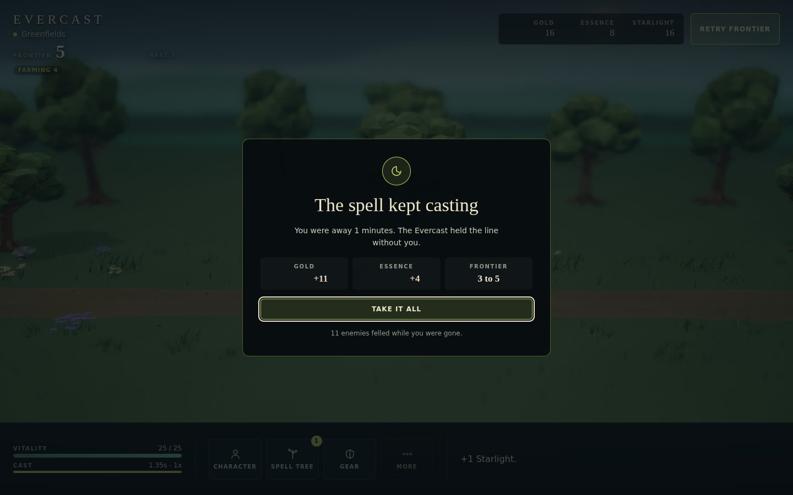

`You were away 1 minutes.` was captured live on the `fresh` save. The `60m`
cases are arithmetic, not grammar: `Math.round` on the remainder can reach 60.

Related: the moment is shown for any absence of 5 seconds or more
(`awayProgress.secondsApplied >= 5` in `AppShell`), and the visibility handler
credits hidden time, so a short tab switch is enough to earn a full-screen
modal reporting `0 minutes`. *(Code path; I could not drive
`visibilitychange` reliably in headless Chromium, so this one is read, not
observed.)* A banner for short absences and the moment only for something
substantial would fit the existing `Moment` discipline better.

### TXT-3: two rings with the same name

`content/gear.ts` gives `ringLeft` and `ringRight` the same
`evolutionNames` array, ending in `Evercast Signet`. On the Character surface,
which renders name + level only, two rows read `Evercast Signet Lv 1503` and
`Evercast Signet Lv 1487` with nothing to tell them apart. The Gear ledger
disambiguates them in its sub-line (`Ring I` / `Ring II`); Character does not.

### TXT-4: numbers said twice

- **Summon**: `Pity 61 / 80` + `19 to a guaranteed Legendary` (stat card),
  then `To a guaranteed Legendary … 19 draws` (meter) directly below.
- **Companions**: `0 / 13 shards` (panel note) + `0 / 13` (meter readout) +
  `Needs 13 more shards` (button).
- **Rebirth**: `Mastery x15.36` (cell) + `Rebirthing now takes Mastery to
  x15.36` (hint).
- **Character**: `Frontier 766 / Best ever 766` duplicates the HUD block that
  is hidden behind the surface.

### TXT-5: unexplained vocabulary

A new player meets, in the first few minutes and with no glossary: *Frontier*,
*Best*, *Pushing* / *Farming n*, *Retry Frontier*, *Arcane Essence* vs
*Essence*, *Starlight*, *Awaken*, *Attunement*, *Mastery*, *Knowledge*,
*Evolution tier*, *Threat*, *Flank*. The derived coach marks cover four of
them. There is no glossary, no tooltip on the HUD terms, and `title`
attributes (used for Threat and Stands) do not exist on touch.

---

## 12. What a AAA bar would add

Everything above is a defect or a gap in something that exists. This section is
the other half of the question — what a player who has played a top-tier
incremental or a mobile RPG would expect to find and does not.

### The loop

- **A rate panel.** Gold/s, Essence/s, Starlight/s, stages/hour, and a
  time-to-afford on every priced button. In an idle game this is not a nicety;
  it is how every purchasing decision is made.
- **"Best next buy".** With eight gear slots, 127 tree nodes and three
  currencies, a damage-per-cost ranking is the difference between an engaging
  optimisation and a spreadsheet.
- **Offline/away summary worth reading.** Currently three numbers and a kill
  count. A graph of where the frontier went, what it stalled on, and what it
  banked would make the return worth something.
- **A session/run history.** Nothing records previous runs, previous rebirths
  or personal bests beyond `highestStageEver`.

### Feedback

- **A defeat moment** ([FEEL-1](#feel-1-death-is-invisible)) that names what
  killed you and what the farm fallback is doing.
- **Reward beats** for evolution, apex nodes, new zones and new bests
  ([FEEL-5](#feel-5-no-reward-beat-for-anything-but-a-summon)).
- **Toasts.** There is no transient notification channel at all, so
  everything either takes a full-screen moment or vanishes into a one-line log.
- **A real log.** Scrollable, filterable by kind, and present on phones.
- **Number roll-ups.** Wallet values snap between magnitudes; a short tween
  and a `+n` flyout is standard and cheap.

### Collection and progression

- **Companion art.** 30 companions, five rarities, and no portraits.
- **Sort, filter and search** on the roster, and on gear.
- **A drag-and-drop formation** rather than a read-only diagram plus a picker.
- **Loadouts / build saving** for the spell tree, given respec exists.
- **A tree overview mode** — route summary, "what am I actually building",
  and a diff against a target build.

### Shell

- **Keyboard shortcuts** and a `?` overlay listing them.
- **A settings entry from the boot gate.**
- **A pause / "stop the world" affordance.** There is no way to stop the
  simulation to read anything.
- **Deep links and a back stack** ([NAV-5](#nav-5-no-back-stack)).
- **PWA install, an icon and a splash colour** — `theme-color` is set, but
  there is no manifest, no icons, no offline shell. For a game with no server
  and three `localStorage` keys, an installable PWA is nearly free and is what
  makes it feel like an app on a phone.
- **Localisation scaffolding.** Every string is a literal in a component.

---

## 13. Recommended sequence

Ordered by (player impact ÷ effort), not by section order.

### Now — small changes, large effect

1. `.surface { position: relative }` in `SurfaceHost.module.css`, or drop the
   scrim background/pointer-events for `modal={false}`. Fixes
   [BLK-1](#blk-1-the-rebirth-surface-traps-the-player). One line.
2. Fix the `WelcomeBack` clock ([TXT-2](#txt-2-the-welcome-back-clock-is-wrong)).
   A few lines and a unit test.
3. Name the effects, statuses, combat states and gear slots in
   `describeGameEvent` ([TXT-1](#txt-1-raw-identifiers-in-the-event-log)).
   Label maps only.
4. Give `.card` in `SummonReveal` a `max-height` and stop a single result
   spanning the grid ([SUR-REVEAL](#sur-reveal-the-summon-reveal)).
5. Show the wallet labels, or icons, below 560px
   ([A11Y-1](#a11y-1-wallets-are-colour-only-below-560px)).
6. Drop the fit clamp so `Fit` can actually fit
   ([BLK-2](#blk-2-the-spell-tree-cannot-be-fitted-or-aimed-at) (a)).
7. Add `scrollIntoView` for the active nav-rail entry, and an edge fade on the
   strip ([NAV-2](#nav-2-the-rail-never-shows-where-you-are)).
8. Ungate the HUD enemy card from `boss`
   ([HUD-1](#hud-1-the-encounter-is-invisible-unless-it-is-a-boss)).

### Next — one focused piece of work each

9. **Sticky action region in `Detail` and `Dashboard`** on short viewports,
   plus a scroll-fade on every archetype scroller. Fixes
   [BLK-3](#blk-3-the-gear-buy-control-is-below-the-fold-on-a-phone),
   [LAY-3](#lay-3-two-stacked-scroll-regions-with-no-affordance) and
   [SUR-SHORT](#sur-short-the-pattern-behind-three-of-these) together.
10. **Spell-tree hit areas and level-of-detail** — minimum 44px hit target,
    labels above a zoom threshold, minimap when the graph overflows rather
    than by breakpoint, toolbar out of the graph's box.
11. **Self-host the two typefaces** ([TYP-1](#typ-1-the-game-ships-no-fonts)).
12. **A defeat moment**, and confirmations on Rebirth and Respec.
13. **Keep the gate up until the away settle finishes**
    ([BLK-4](#blk-4-the-first-frame-after-continue-blocks-for-seconds)).
14. **Make the log real**: history, present on phones, in the space
    [LAY-1](#lay-1-surfaces-do-not-use-the-screen) is currently wasting.

### Then — design work, not just fixes

15. A content-width and density pass across all surfaces
    ([LAY-1](#lay-1-surfaces-do-not-use-the-screen)): what fills the space,
    rather than how to centre the emptiness.
16. Rates and time-to-afford everywhere.
17. Companion art, rarity expression, and roster sort/filter/search.
18. An interactive formation.
19. Aspect-aware camera framing
    ([LAY-5](#lay-5-the-diorama-is-framed-for-one-aspect-ratio)).
20. Reconcile the rendered biome with the named zone
    ([FEEL-4](#feel-4-the-hud-and-the-world-name-different-places)).

---

## 14. Regression tests worth adding

The existing suites split two ways. `ui/architecture.test.ts`,
`ui/mobile.test.ts` and `ui/accessibility.test.ts` are regex passes over source
text; `Shelf`, `Ledger`, `Moment`, `BootGate` and `SummonReveal` each have a
`.test.tsx` that renders through `renderToStaticMarkup` and asserts over the
resulting **string**. Both are deliberate, well-judged choices for the rules
they encode — and between them they are why every finding in sections 4-8
survived: a regex cannot see geometry, and neither can markup with no DOM, no
CSS and no layout. **Nothing in the repository ever lays out a screen**, so
nothing can observe an overlay covering a button, a control below the fold, or
a 6px hit target. Three of the four S1 defects would fall to a single
laid-out assertion.

Worth adding, in order of value per line:

1. **A "no overlay covers its own chrome" test.** Render each surface, assert
   `document.elementFromPoint` over the Back button and over a rail entry
   returns that element. Catches [BLK-1](#blk-1-the-rebirth-surface-traps-the-player)
   and anything like it.
2. **A "primary action is above the fold" test.** For each surface at
   390x844 and 844x390, assert the first `<button>` marked as the surface's
   primary action is within the viewport. Catches
   [BLK-3](#blk-3-the-gear-buy-control-is-below-the-fold-on-a-phone) and
   [SUR-SHORT](#sur-short-the-pattern-behind-three-of-these).
3. **A hit-target test on coarse pointers.** Every element with a click
   handler measures at least 44x44 at the default zoom. Catches
   [BLK-2](#blk-2-the-spell-tree-cannot-be-fitted-or-aimed-at) (b) and
   [A11Y-2](#a11y-2-touch-targets-under-44px).
4. **A fit test for `Graph`.** After `fit()`, assert the layout bounds are
   fully inside the viewport at every breakpoint. Catches
   [BLK-2](#blk-2-the-spell-tree-cannot-be-fitted-or-aimed-at) (a) — and this
   one is a pure unit test over `fitToBounds`, no DOM required.
5. **A horizontal-overflow test.** No element's border box may exceed the
   viewport width, except inside a container that is explicitly marked
   scrollable. Catches the class of bug the 860px and 560px media queries were
   each written to fix after the fact.
6. **Snapshot the copy.** A test that renders `describeGameEvent` for every
   `GameEvent` variant and asserts no output contains a raw identifier
   (`/\b[a-z]+[A-Z]/` for camelCase, plus an allow-list of known nouns).
   Catches [TXT-1](#txt-1-raw-identifiers-in-the-event-log).
7. **Unit-test the away-time formatter** with the table in
   [TXT-2](#txt-2-the-welcome-back-clock-is-wrong).

Items 4, 6 and 7 are pure unit tests and need nothing new. Items 1 and 2 need
a real layout engine — `jsdom` reports zero for every box, so this is
`@testing-library/react` under `happy-dom` at best, and Playwright properly.
Items 3 and 5 need Playwright outright, which is how this audit was produced,
and which gives screenshot diffs for free.

---

## Appendix: viewports exercised

| Class | Sizes |
| --- | --- |
| Desktop | 1920x1080, 1440x900, 1280x800, 1024x768 |
| Tablet | 820x1180 portrait, 1180x820 landscape |
| Phone portrait | 390x844, 360x800, 320x568 |
| Phone landscape | 844x390, 932x430, 667x375, 568x320 |

Screens captured at each: boot gate, welcome-back moment, premise moment, the
live HUD, and all nine destinations (Character, Spell Tree, Gear, Companions,
Party, Summon, Attunements, Rebirth, Settings), plus a scrolled variant of any
surface with hidden content. Additional states captured on a fresh save
(onboarding coach mark, empty roster, empty party) and on a late save
(a single-pull summon reveal on desktop and phone).
